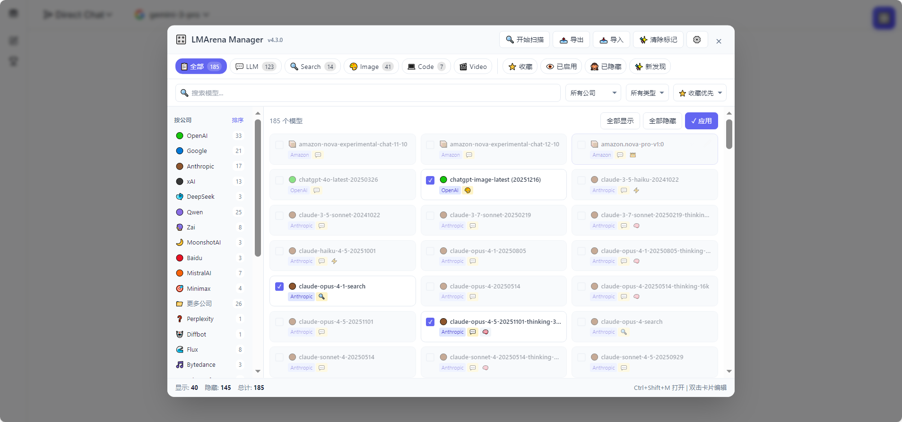
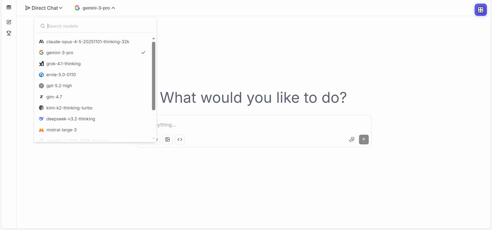

# 🎛️ LMArena Manager

> 智能管理 LMArena 模型显示的油猴脚本

## ✨ 功能特性

- 🎯 **精准筛选** - 按公司、类型、Arena模式快速过滤模型
- 👁️ **显示控制** - 一键切换模型显示/隐藏，告别选择困难
- 🏢 **智能分类** - 自动识别60+公司和5种模型类型
- 🔄 **自定义排序** - 拖拽调整公司显示顺序
- ✏️ **手动编辑** - 修正分类错误，自定义标签
- 📤 **导入导出** - 配置云同步友好
- 🌙 **深色模式** - 自动适配系统主题

## 🎮 支持的 Arena 模式

| 模式 | 图标 | 说明 |
|------|------|------|
| LLM | 💬 | 文本对话模型 |
| Search | 🔍 | 搜索增强模型 |
| Image | 🎨 | 图像生成模型 |
| Code | 💻 | 编程专属模型 |
| Video | 🎬 | 视频模型（预留） |

## 📦 安装

### 前置要求
- 浏览器安装 [Tampermonkey](https://www.tampermonkey.net/) 或 [Violentmonkey](https://violentmonkey.github.io/)

### 安装方式

**方式一：从 Greasy Fork 安装（推荐）**

**方式二：手动安装**

1. 点击浏览器扩展图标 → 添加新脚本
2. 复制 [`lmarena-manager.user.js`](./lmarena-manager.user.js) 内容
3. 保存并启用

## 🚀 使用方法

1. 访问 [LMArena](https://lmarena.ai)
2. 点击页面上的模型选择下拉框（让模型列表加载）
3. 点击右上角 **🎛️** 按钮 或按 **Ctrl+Shift+M**
4. 点击 **🔄 扫描** 获取模型列表
5. **单击**模型卡片切换显示/隐藏
6. **双击**模型卡片编辑详细信息
7. 点击 **✓ 应用** 使更改生效

## 📸 截图

<!-- 建议添加截图 -->

## ⌨️ 快捷键

| 快捷键 | 功能 |
|--------|------|
| `Ctrl+Shift+M` | 打开/关闭管理面板 |
| `Esc` | 关闭当前弹窗 |

## 🏢 支持的公司

点击展开完整列表

（重复公司只展示一次）
  
### LLM
Google, OpenAI, Anthropic, xAI, DeepSeek, Qwen, MoonshotAI, Zhipu, Baidu, MistralAI, LongCat, Xiaomi, Tencent, Minimax, Amazon, PrimeIntellect, IBM, Cohere, AntGroup, Stepfun, Meta, Nvidia, AllenAI, Inception

### Search
Perplexity, Diffbot

### Image
Bytedance, ShengShu, MicrosoftAI, Flux, Recraft, Luma, Ideogram, Reve, LeonardoAI

### Code
Kwai

## 🏷️ 类型标签

| 标签 | 含义 | 匹配规则 |
|------|------|----------|
| ⚡ 快速 | 低延迟模型 | flash, fast, turbo, haiku |
| 🧠 思考 | 深度推理模型 | thinking, reasoner, o3, o4 |
| 👑 旗舰 | 顶级性能 | pro, max, ultra, high |
| 📱 轻量 | 轻量高效 | mini, nano, small |
| 🔓 开源 | 开源模型 | llama, qwen, glm, deepseek... |

## 📝 更新日志

### v4.1.0 (2025-xx-xx)
- ✨ 支持5种Arena模式：LLM/Search/Image/Code/Video
- ✨ 智能识别60+公司
- ✨ 公司拖拽排序
- ✨ 模型手动编辑
- ✨ 清空列表功能
- 🐛 修复Code模式分类逻辑

### v1.0.0
- 初始版本

## 🤝 贡献

欢迎提交 Issue 和 Pull Request！

- 🐛 Bug 反馈请附带浏览器版本和控制台错误信息
- ✨ 新功能建议请描述使用场景

## 📄 许可证

[MIT License](./LICENSE)

## 🙏 致谢

- [LMArena](https://lmarena.ai) - 模型评测平台
- [Tampermonkey](https://www.tampermonkey.net/) - 用户脚本管理器

---

**如果这个项目对你有帮助，欢迎 ⭐ Star！**
